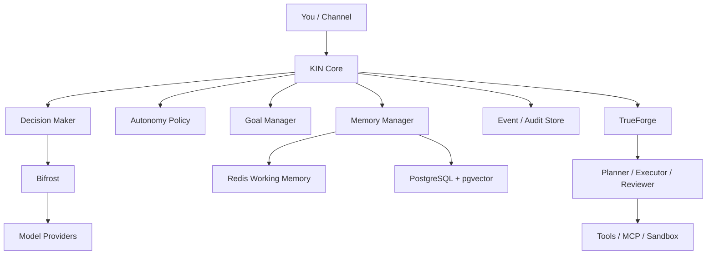
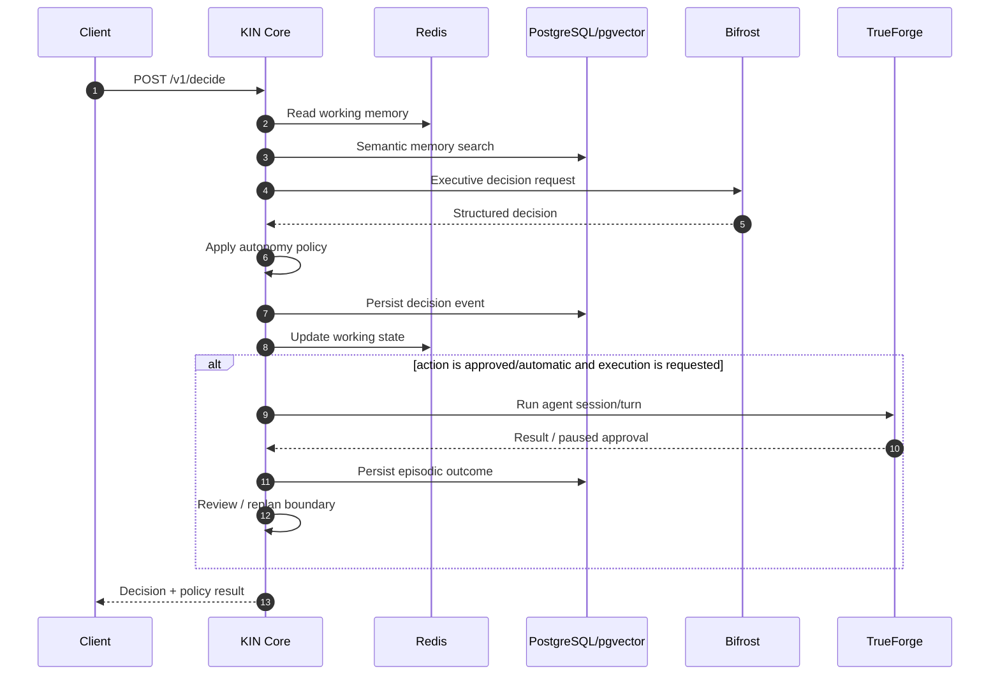
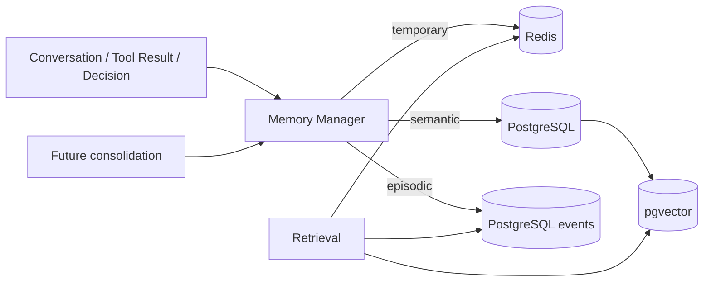
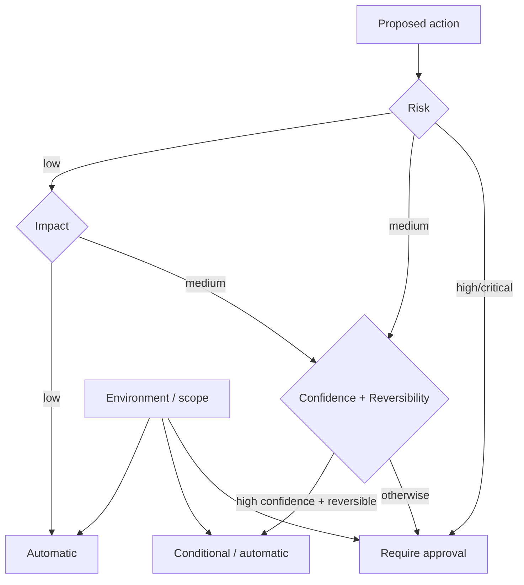
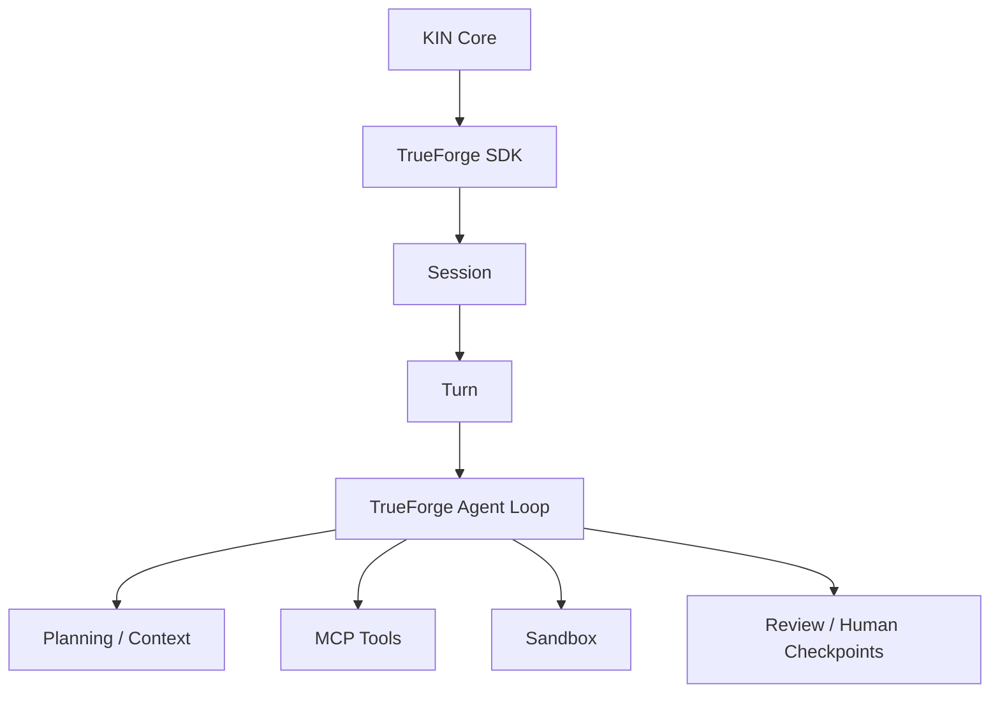
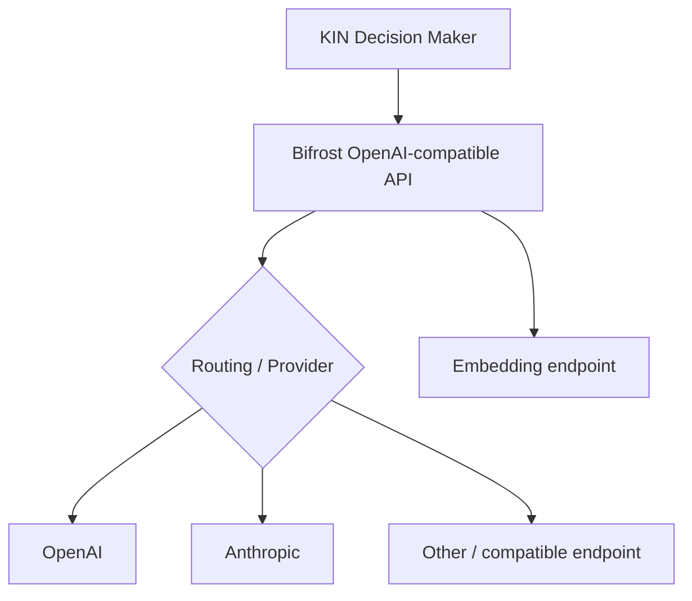
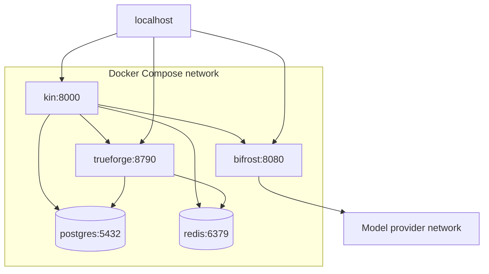
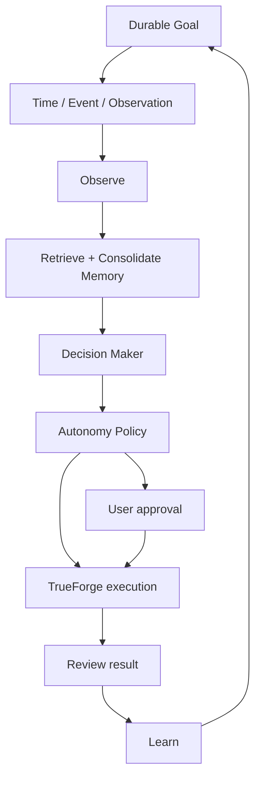

# KIN Architecture

KIN is an executive/orchestration layer around two upstream systems rather than a competing agent framework or model gateway.

## 1. System architecture



### Boundary rule

KIN decides **what should happen next**. TrueForge decides **how agent work is executed**. Bifrost decides **which model/provider serves a model request**.

## 2. Main decision loop



## 3. Memory architecture



The v0.1.0 memory API deliberately requires an explicit memory type and importance. Expiration and tags are stored as metadata. Episodic events are append-oriented audit records, not free-form semantic blobs.

## 4. Autonomy policy



The local policy is intentionally stricter than the model prompt. The model cannot grant itself permission.

## 5. TrueForge integration



KIN does not implement MCP, sandboxing, tool approval protocols, or a separate agent runtime. The TrueForge SDK is used only for session/turn orchestration.

## 6. Bifrost / model routing



KIN uses logical model names, such as `openai/gpt-4o-mini`, and does not contain provider-specific SDK code.

## 7. Docker Compose topology



PostgreSQL and Redis have no host port mapping.

## 8. Future proactive / long-running goal loop



The worker/scheduler is intentionally future architecture for v0.1.0. TrueForge itself already supports schedules; KIN will consume that capability rather than building another scheduler when the proactive layer is added.

## State model

```text
Goal
  -> Decision
      -> Policy evaluation
          -> Task / execution request
              -> Observation
                  -> Review
                      -> Event / memory
                          -> next Decision
```

## Data ownership

| Data | Owner | Store |
| --- | --- | --- |
| Current working context | KIN | Redis |
| Goals | KIN | PostgreSQL |
| Semantic memory | KIN | PostgreSQL + pgvector |
| Episodic audit/events | KIN | PostgreSQL |
| Agent sessions/turns | TrueForge | TrueForge PostgreSQL schema |
| Provider routing/config | Bifrost | Bifrost file config in v0.1.0 |

The Compose project uses a single PostgreSQL server with separate databases/users: KIN's `kin` database and TrueForge's `trueforge` database.
