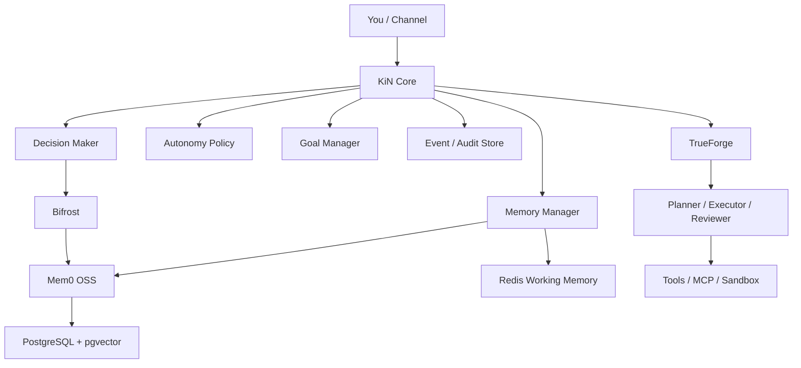
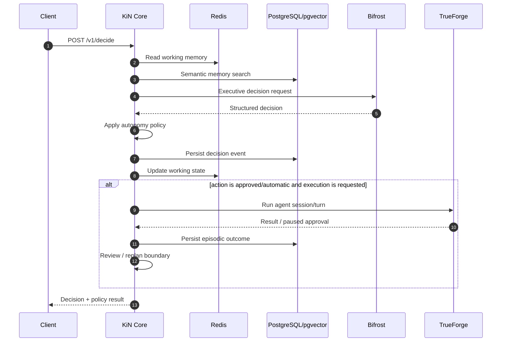
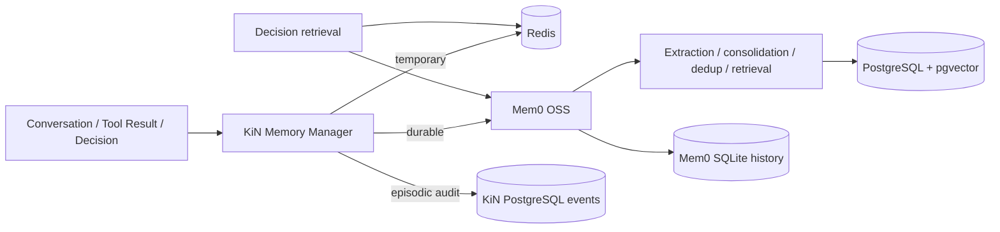
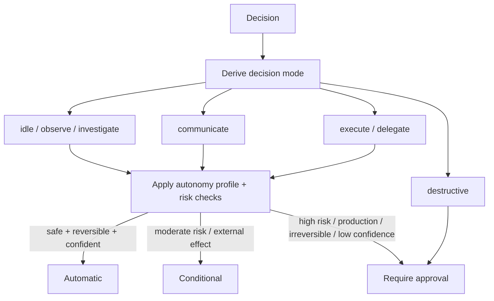
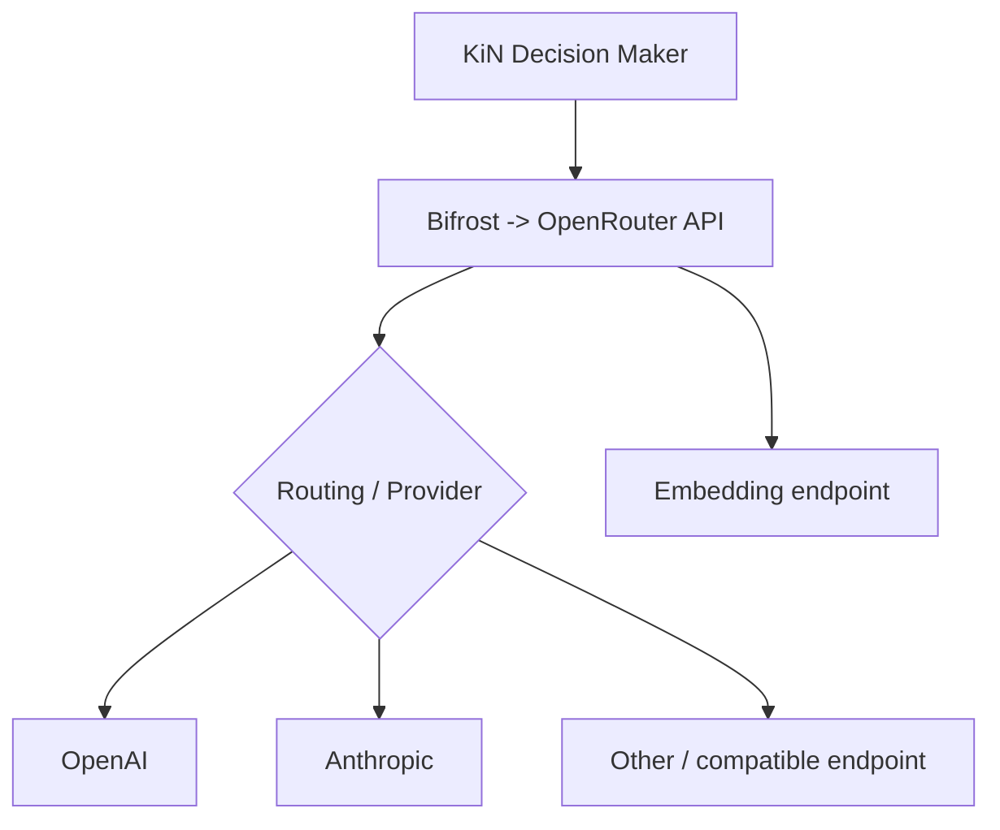
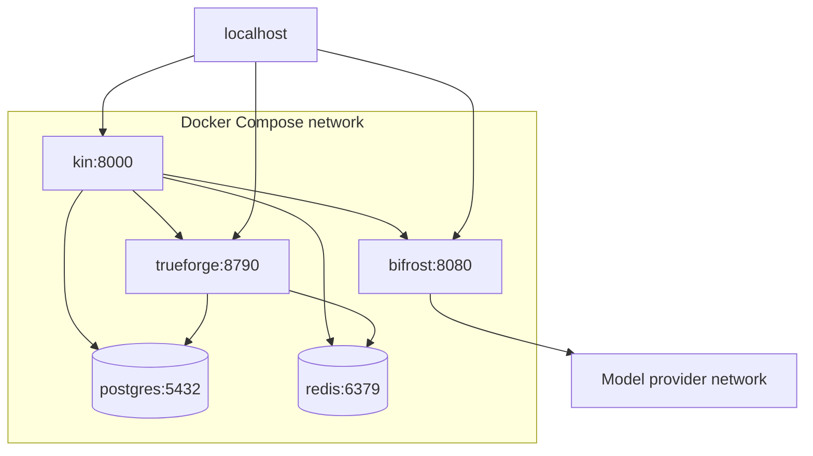
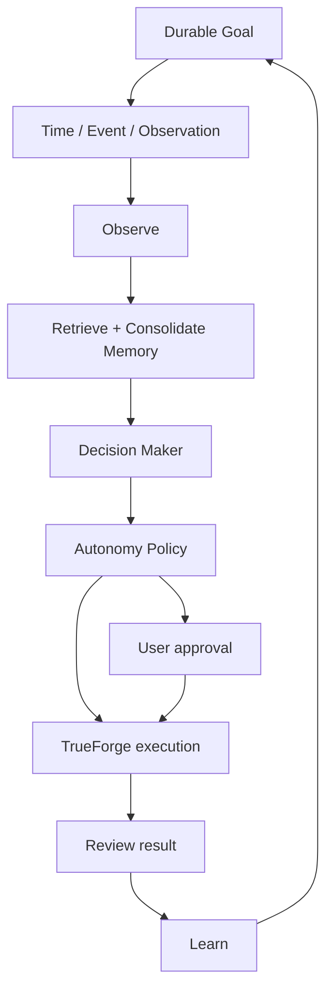

# KiN Architecture

KiN is an executive/orchestration layer around two upstream systems rather than a competing agent framework or model gateway.

## 1. System architecture



### Boundary rule

KiN decides **what should happen next**. TrueForge decides **how agent work is executed**. Bifrost decides **which model/provider serves a model request**.

## 2. Main decision loop



## 3. Memory architecture



Mem0 OSS owns durable memory semantics. KiN does not maintain a second vector-search, extraction, deduplication, or consolidation engine. Redis remains working memory and the KiN events table remains the durable episodic/audit stream.

## 4. Autonomy policy



The profile (`cautious`, `balanced`, `autonomous`) adjusts thresholds. The mode is derived from the decision itself. JEV 1.13 is an optional future gate because its OpenRouter interface is a Decisions API rather than normal chat completions.

## 5. TrueForge integration


KiN does not implement MCP, sandboxing, tool approval protocols, or a separate agent runtime. The TrueForge SDK is used only for session/turn orchestration.

## 6. Bifrost / model routing



KiN uses OpenRouter model IDs, such as `anthropic/claude-sonnet-5.5`, and does not contain provider-specific SDK code.

## 7. Docker Compose topology



PostgreSQL and Redis have no host port mapping. TrueForge publishes its Web UI + API on localhost:8790 by default; public exposure requires TLS + OIDC.

## 8. Future proactive / long-running goal loop



The worker/scheduler is intentionally future architecture for v0.1.0. TrueForge itself already supports schedules; KiN will consume that capability rather than building another scheduler when the proactive layer is added.

## State model

```text
Goal
  -> Decision
      -> Policy evaluation
          -> Task / execution request
              -> Observation
                  -> Review
                      -> Event / memory
                          -> next Decision
```

## Data ownership

| Data | Owner | Store |
| --- | --- | --- |
| Current working context | KiN | Redis |
| Goals | KiN | PostgreSQL |
| Durable semantic memory | Mem0 OSS under KiN | PostgreSQL + pgvector |
| Mem0 memory history | Mem0 OSS under KiN | SQLite on the KiN data volume |
| Episodic audit/events | KiN | PostgreSQL |
| Agent sessions/turns | TrueForge | TrueForge PostgreSQL schema |
| Provider routing/config | Bifrost | Bifrost file config in v0.1.0 |

The Compose project uses a single PostgreSQL server with separate databases/users: KiN's `kin` database and TrueForge's `trueforge` database.
